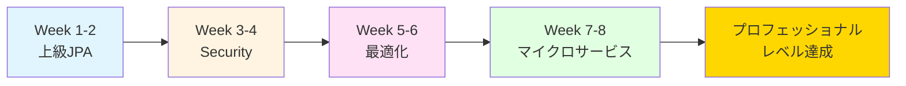

# 🚀 Java + Spring Boot 上級プロフェッショナル学習計画（8週間）

[](https://opensource.org/licenses/MIT)
[](https://www.oracle.com/java/)
[](https://spring.io/projects/spring-boot)

> ECサイト注文管理システムを通じて、エンタープライズレベルのJava + Spring Boot開発を習得する8週間の集中学習プログラム

## 📖 概要

このリポジトリは、中上級レベルの開発者がプロフェッショナル級のJava + Spring Boot開発スキルを習得するための体系的な学習計画を提供します。実世界のECサイト注文管理システムを例に、エンタープライズ開発に必要なすべてのコア技術を網羅しています。

### 🎯 学習目標

- **上級JPA**: 複雑な関連マッピング、動的クエリ、N+1問題の解決、JdbcClient
- **Spring Security**: JWT認証、OAuth 2.0基礎、ロールベースアクセス制御
- **パフォーマンス最適化**: Virtual Threads、Redisキャッシュ、分散ロック、並行制御
- **イベント駆動とコンテナ**: RabbitMQ、Docker基礎、イベント駆動アーキテクチャ

### ⏱️ 新しい学習スケジュール

**平日理論 + 週末実践の柔軟なスケジュール**
- 📚 **平日（火・木曜）**: 30-60分の理論学習
  - 概念理解、コード閲読、小練習に集中
  - 仕事の日に適した軽い学習負担
  
- 💻 **週末（土日いずれか）**: 1-2時間のプロジェクト実践
  - 完全な機能実装、統合テスト
  - 深い実践のための十分な時間

**総学習時間：約26-27時間**（8週間で完了）

---

## 📚 学習内容

学習計画は2つのパートに分かれています：

### 📘 Part 1: Week 1-4 - 基礎アーキテクチャ

#### Week 1-2: 上級JPAとデータモデリング
- エンティティ関連マッピング（一対多、多対多）
- JPAライフサイクルコールバックと監査
- Specification動的クエリ
- **JdbcClient**（Spring Boot 3.3新機能）
- トランザクション管理
- N+1問題の解決戦略

#### Week 3-4: Spring Securityと認証認可
- JWT認証メカニズムの実装
- **OAuth 2.0 / OpenID Connect基礎**（現代認証標準）
- ロールベースアクセス制御（RBAC）
- **RestClient**（RestTemplateの後継）
- カスタム権限チェックロジック

**Part 1 学習時間：約12.5時間**

---

### 📗 Part 2: Week 5-8 - パフォーマンス最適化とマイクロサービス

#### Week 5-6: パフォーマンス最適化とキャッシュ
- **Virtual Threads**（Java 21 + Spring Boot 3.3）
  - Virtual Threads基礎概念
  - Spring Boot 3.3での有効化
  - 簡単なパフォーマンス比較
- Redisキャッシュ統合
- キャッシュ更新戦略
- 分散ロックの実装
- 並行制御とデッドロック回避
- **オブザーバビリティ基礎**（Micrometer）

#### Week 7-8: イベント駆動とコンテナ化
- RabbitMQメッセージキュー
- イベント駆動アーキテクチャ
  - Event Sourcing概念
  - CQRS パターン概要
- 非同期処理とメッセージ信頼性
- **Docker基礎**（Kubernetesへの準備）
  - Dockerfileの作成
  - Docker Composeローカル環境
  - 基本的なコンテナ操作
- 総合実戦プロジェクト

**Part 2 学習時間：約14時間**

---

## 🗂️ ファイル構成

```
.
├── src　　　　　　　　　　　　　       # 実装ソース(未)
├── ...                                     
└── README.md                         # このファイル
```

---

## 🚀 使い方

### 前提条件

- Java 21以上（Virtual Threads対応）
- Spring Boot 3.3以上の基礎知識
- 基本的なJPA/Hibernateの理解
- データベース（MySQL/PostgreSQL）の基礎知識
- Docker基礎知識（Week 7-8で学習）

> 💡 **環境インストールガイド:** 開発環境のセットアップ方法は [ENVIRONMENT_SETUP.md](../ENVIRONMENT_SETUP.md) を参照してください

### 学習方法

#### 📚 平日理論学習（火・木曜、30-60分）

1. **理論学習 (20-30分)**
   - コア概念の理解
   - 公式ドキュメント閲読

2. **コード閲読 (15-20分)**
   - サンプルコードの分析
   - ベストプラクティスの学習

3. **小練習 (5-10分)**
   - 簡単な設計課題
   - 概念の確認

#### 💻 週末プロジェクト実践（土日いずれか、1-2時間）

1. **環境設定・準備**
   - 必要な依存関係の追加
   - 設定ファイルの準備

2. **機能実装**
   - 完全な機能の実装
   - コードの統合

3. **テストと検証**
   - 単体テスト
   - 統合テスト
   - 機能検証

---

## 💡 プロジェクト例: ECサイト注文管理システム

学習計画全体を通じて、以下のモジュールを段階的に構築します：

### 主要機能

- **ユーザー管理**: 登録、ログイン、JWT認証、ロール権限
- **商品管理**: CRUD操作、カテゴリ管理、在庫管理、Redisキャッシュ
- **注文管理**: 注文作成、動的検索、ステータス遷移、キャンセル処理
- **決済処理**: 決済記録、コールバック処理、返金管理
- **通知システム**: RabbitMQ非同期通知、メール送信、サイト内メッセージ

### 技術スタック

```
Backend:
├── Java 21+ (Virtual Threads)
├── Spring Boot 3.3+
├── Spring Data JPA + JdbcClient
├── Spring Security (JWT + OAuth 2.0)
├── RestClient
└── Lombok

Database:
├── MySQL/PostgreSQL
└── Redis

Message Queue:
└── RabbitMQ

Containerization:
├── Docker
└── Docker Compose

Observability:
└── Micrometer

Tools:
├── Maven/Gradle
└── Postman/JMeter
```

---

## 📊 学習ロードマップ



---

## 🎓 学習成果チェックリスト

学習完了後、以下のスキルを習得できます：

### JPA上級
- [ ] 複雑な関連マッピングの実装
- [ ] 動的クエリの構築
- [ ] **JdbcClientの使用** (Spring Boot 3.3)
- [ ] N+1問題の解決
- [ ] 楽観的/悲観的ロックの使用

### Spring Security
- [ ] JWT認証の実装
- [ ] **OAuth 2.0 / OpenID Connect基礎理解**
- [ ] **RestClientの使用** (RestTemplateの後継)
- [ ] ロールベースアクセス制御
- [ ] カスタム権限チェック

### パフォーマンス最適化
- [ ] **Virtual Threadsの理解と有効化** (Java 21)
- [ ] Redisキャッシュの実装
- [ ] 分散ロックの使用
- [ ] 並行制御の実装
- [ ] **Micrometer基礎メトリクス**

### イベント駆動とコンテナ
- [ ] RabbitMQの使用
- [ ] イベント駆動アーキテクチャの実装
- [ ] **Event Sourcing / CQRS概念理解**
- [ ] 非同期処理の実装
- [ ] **Docker基礎** (Dockerfile, Docker Compose)

---

## 📖 推奨リソース

### 公式ドキュメント
- [Spring Data JPA](https://spring.io/projects/spring-data-jpa)
- [Spring Security](https://spring.io/projects/spring-security)
- [Redis](https://redis.io/documentation)
- [RabbitMQ](https://www.rabbitmq.com/getstarted.html)

### 書籍
- 『Spring実戦』(Spring in Action)
- 『Javaパフォーマンス権威ガイド』
- 『高性能MySQL』
- 『エンタープライズアプリケーションアーキテクチャパターン』

---

## 🚀 次のステップ

本学習計画完了後、以下のトピックに進むことをお勧めします：

### 📘 推奨：上級クラウドネイティブ・マイクロサービス学習計画（12週間）

本計画で学んだ基礎知識を活かして、さらに上級のクラウドネイティブアーキテクチャを習得できます。

#### 本計画との接続

```yaml
基礎課程（8週間） → 上級課程（12週間）

Week 1-2 (JPA + JdbcClient) → Week 1-4 (マイクロサービス設計)
Week 3-4 (JWT + OAuth基礎) → Week 3-4 (API Gateway認証)
Week 5-6 (Virtual Threads) → Week 7-8 (Kubernetes性能最適化)
Week 5-6 (Redis) → Week 5-6 (分散キャッシュ戦略)
Week 7-8 (Docker基礎) → Week 5-8 (Kubernetes完全習得)
Week 7-8 (RabbitMQ) → Week 9-10 (Apache Kafka)
Week 7-8 (Event Sourcing概念) → Week 9-10 (イベント駆動完全実装)
```

#### 上級課程の内容

1. **マイクロサービスアーキテクチャ（Week 1-4）**
   - Spring Cloud (Eureka, Config, Gateway)
   - サービス発見と負荷分散
   - サーキットブレーカー (Resilience4j)
   - 集中設定管理

2. **コンテナ化とオーケストレーション（Week 5-8）**
   - Docker 完全習得
   - Kubernetes コンテナオーケストレーション
   - Helm パッケージ管理
   - 自動スケーリングとローリングアップデート

3. **イベント駆動とビッグデータ（Week 9-10）**
   - Apache Kafka メッセージングシステム
   - Kafka Streams ストリーム処理
   - Elasticsearch 全文検索
   - Saga 分散トランザクション

4. **オブザーバビリティとDevOps（Week 11-12）**
   - Prometheus + Grafana 監視システム
   - ELK Stack ログ管理
   - OpenTelemetry 分散トレーシング
   - CI/CD 自動化パイプライン

### 🎯 学習の準備状況

本計画完了後、以下のスキルを習得しているため、上級課程にスムーズに移行できます：

- ✅ **Virtual Threads**: Kubernetes での高性能アプリケーション構築の基礎
- ✅ **Docker 基礎**: コンテナオーケストレーションの前提知識
- ✅ **OAuth 2.0 概念**: マイクロサービス認証の理解
- ✅ **Event Sourcing/CQRS**: イベント駆動アーキテクチャの基礎
- ✅ **Micrometer**: 完全な監視システム構築の出発点

---

## 🔗 その他の学習方向

上級課程以外にも、以下の分野を深く学習できます：

### サービスメッシュ
- Istio
- Linkerd
- トラフィック管理とセキュリティ

### クラウドプラットフォーム
- AWS (EKS, MSK, RDS)
- Azure (AKS, Event Hubs)
- GCP (GKE, Pub/Sub)

### 上級データ処理
- Apache Flink (リアルタイムストリーム処理)
- Apache Spark (ビッグデータバッチ処理)
- ClickHouse (OLAP分析)

---

## 📊 時間統計総覧

### 平日理論学習（16回）
- Week 1-2: 4回 × 45分 = 3時間
- Week 3-4: 4回 × 45分 = 3時間
- Week 5-6: 4回 × 47.5分 = 3.2時間
- Week 7-8: 4回 × 47.5分 = 3.2時間
- **小計：約12.4時間**

### 週末プロジェクト実践（8回）
- Week 1-2: 2回 × 1.5時間 = 3時間
- Week 3-4: 2回 × 1.75時間 = 3.5時間
- Week 5-6: 2回 × 2時間 = 4時間
- Week 7-8: 2回 × 2時間 = 4時間
- **小計：約14.5時間**

**総学習時間：約26-27時間**（8週間完了）

---

## 🤝 貢献

このプロジェクトへの貢献を歓迎します！

1. このリポジトリをフォーク
2. 新しいブランチを作成 (`git checkout -b feature/improvement`)
3. 変更をコミット (`git commit -am 'Add some improvement'`)
4. ブランチにプッシュ (`git push origin feature/improvement`)
5. プルリクエストを作成

---

## 📝 ライセンス

このプロジェクトはMITライセンスの下で公開されています。

---

## ⭐ サポート

このプロジェクトが役に立った場合は、ぜひスターをつけてください！

---

**学習の成功をお祈りします！Javaバックエンドエキスパートへの道を楽しんでください！** 🎉
